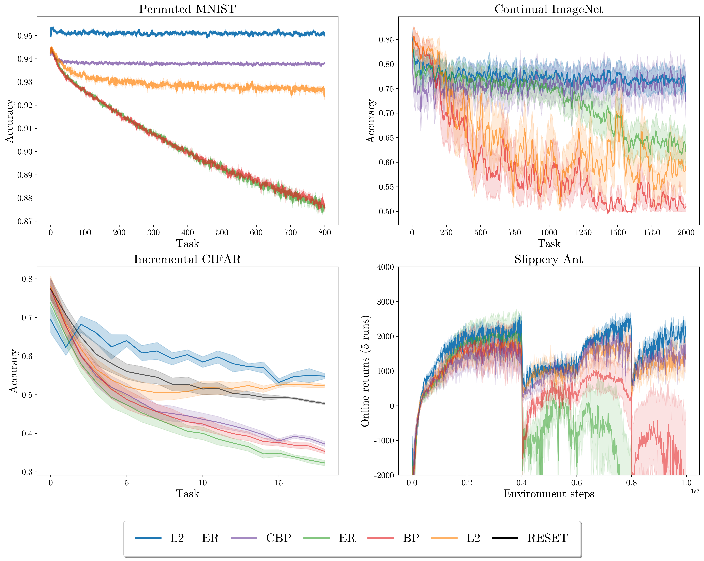
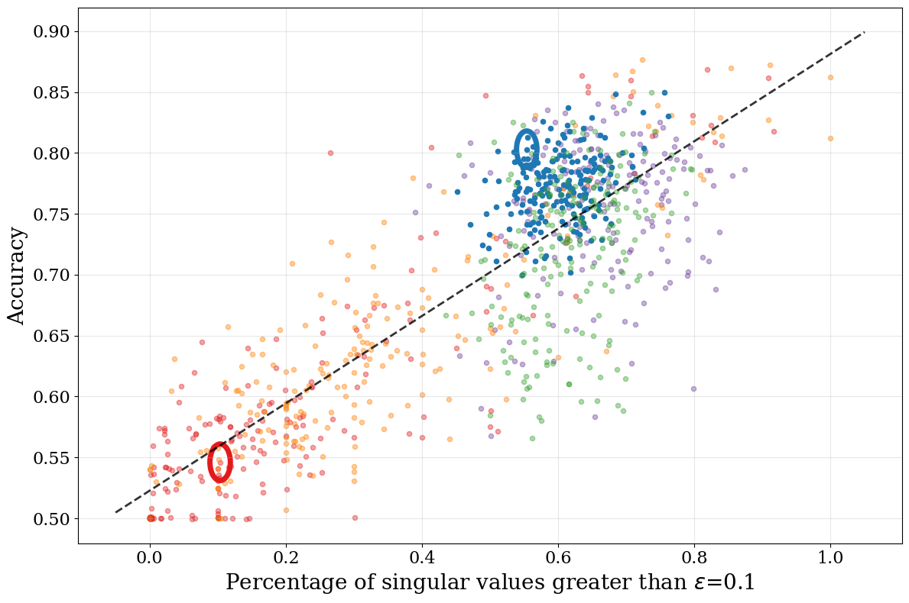

# Spectral Collapse Drives Loss of Plasticity in Deep Continual Learning

Code for **"Spectral Collapse Drives Loss of Plasticity in Deep Continual Learning"** (ICML 2026).

**Authors:** Arjun Prakash\*, Naicheng He\*, Kaicheng Guo\*, Saket Tiwari, Tyrone Serapio, Ruo Yu Tao, Amy Greenwald, George Konidaris

We show that **Hessian spectral collapse** -- the degeneration of the loss landscape's curvature spectrum -- is the central mechanism behind plasticity loss in continual learning. We propose **L2-ER**, a simple regularizer combining L2 weight decay with an effective rank penalty, that directly prevents spectral collapse and preserves plasticity across diverse benchmarks.

## Performance

L2-ER maintains plasticity across all four environments. Classification accuracy is reported for supervised benchmarks; online returns for RL.

<p align="center">
  
</p>

## Hessian Epsilon-Rank vs. Accuracy

Across tasks on Continual ImageNet, training accuracy is positively correlated with the epsilon-rank of the Hessian (R^2 = 0.711). L2-ER (blue) preserves high epsilon-rank; BP (red) collapses.

<p align="center">
  
</p>

## Benchmarks

| Benchmark | # Tasks | Model | Metric |
|---|---|---|---|
| Permuted MNIST | 800 | 3-layer MLP (width 1000) | Accuracy |
| Continual ImageNet | 2000 | ResNet-18 | Accuracy |
| Incremental CIFAR | 20 | ResNet-18 | Accuracy |
| Slippery Ant (RL) | 5 env changes | Actor-Critic MLP (width 256) | Online returns |

## Algorithms

| Method | `--agent` key | Description |
|---|---|---|
| Backpropagation | `bp` | Standard baseline |
| L2 Regularization | `l2` | L2 weight decay |
| Effective Rank | `er` | Maximizes effective rank of activations |
| **L2-ER (Ours)** | `l2_er` | L2 + effective rank penalty |
| Continual Backprop | `cbp` | Replaces low-utility neurons |
| LayerNorm + L2 | `laynorm_l2` | Layer normalization with L2 |
| Spectral Reg | `spectral_reg` | Regularizes weight singular values |
| Reset | `reset` | Reinitializes at task change (CIFAR only) |

## Installation

Requires Python >= 3.11 and [uv](https://docs.astral.sh/uv/).

```bash
git clone https://github.com/<user>/lop-jax.git
cd lop-jax
uv sync
```

This creates a `.venv`, resolves all dependencies (JAX with CUDA 12, PyTorch, Flax, Optax, Brax, etc.), and installs the project in editable mode. Use `uv run` to execute commands in the virtual environment:

## Datasets

Download and preprocess data before training. MNIST and CIFAR-100 are downloaded automatically by the scripts; Continual ImageNet requires the preprocessed data from the [Loss of Plasticity](https://github.com/shibhansh/loss-of-plasticity) repo (Dohare et al., 2024).

```bash
# Permuted MNIST
cd permuted_mnist && uv run python load_mnist.py

# Incremental CIFAR-100
cd incremental_cifar && uv run python load_cifar.py

# Continual ImageNet — download preprocessed .npy class files from
# https://github.com/shibhansh/loss-of-plasticity
# then update the data path in imagenet/train_imagenet.py (load_imagenet)
```

## Usage

### Training

```bash
uv run python -m imagenet.train_imagenet --agent bp --weight_decay 0.0 --lr 0.0001 --seed 2054 --num_tasks 2000 --n_seeds 1 --platform gpu --study_name bp_hessian --debug
```

### Hessian Computation

Add `--compute_hessian --compute_hessian_interval 100` to any training command. Eigenspectra are saved to `hessian/data/` and plots to `hessian/plots/`.

### Hyperparameter Sweeps

**1. Generate jobs** from a hyperparameter config:
```bash
cd <benchmark>/scripts
uv run python write_jobs.py hyperparams/<agent>.py
```
This writes one command per hyperparameter combination to `scripts/runs/`.

**2. Parse results** after training completes:
```bash
uv run python parse_experiments.py ../results
```
This aggregates across seeds and hyperparameters, producing `best_hyperparam_per_env_res.pkl`.

**3. Plot:** Update the results path in `plot_single_metric.py` to point to your saved results, then run:
```bash
uv run python plot_single_metric.py
```

## Repository Structure

```
lop-jax/
├── permuted_mnist/          # Permuted MNIST benchmark
├── imagenet/                # Continual ImageNet benchmark
├── incremental_cifar/       # Incremental CIFAR-100 benchmark
├── rlopt/                   # Slippery Ant RL benchmark
├── analysis/                # Hessian analysis & paper figures
├── results/                 # Experiment outputs
├── requirements.txt
└── setup.py
```

Each benchmark contains: `train_*.py` (training), `config.py` (hyperparameters), `cbp.py` (Continual Backprop), `scripts/` (job generation & plotting), and `utils/` (Hessian computation, Lanczos algorithm, evaluation metrics).

## Citation

```bibtex
@inproceedings{prakash2026spectral,
  title     = {Spectral Collapse Drives Loss of Plasticity in Deep Continual Learning},
  author    = {Prakash, Arjun and He, Naicheng and Guo, Kaicheng and Tiwari, Saket and Serapio, Tyrone and Tao, Ruo Yu and Greenwald, Amy and Konidaris, George},
  booktitle = {Proceedings of the 43rd International Conference on Machine Learning},
  year      = {2026}
}
```
