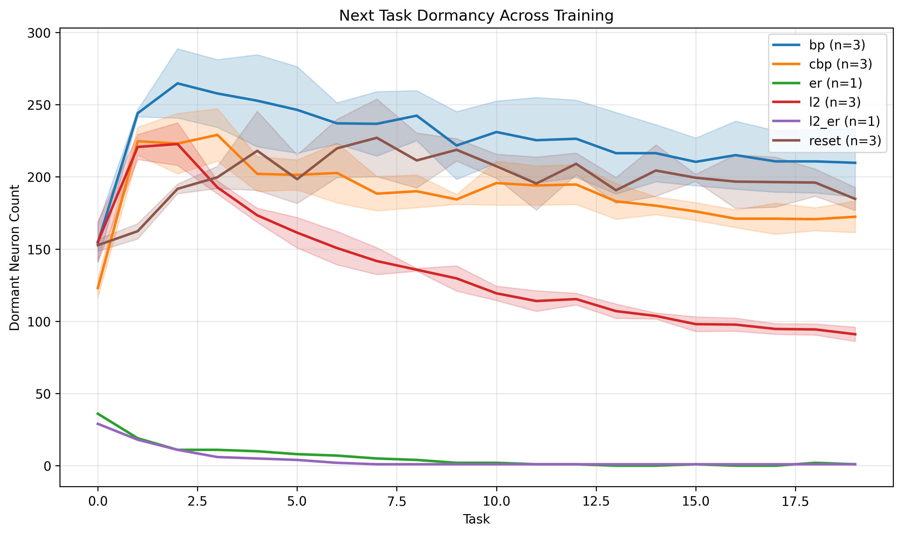

## 1. Important Files
- **Train file (in the main directory)**
  Train file:
  - `train_incremental_cifar.py` was modified to also save train states at the end of each task (saving to device happens after the whole training though)
- **Shell files (in the main directory)**  
  Used to run specific seed/s (run from incremental_cifar directory):  
  - `sbatch bp_train.sh`  
  - `sbatch l2_train.sh`  
  - `sbatch cbp_train.sh`
  - `sbatch l2er_train.sh`
  - `sbatch er_train.sh`
  - `sbatch reset_train.sh`

- **Scripts (inside `scripts/` folder)**  
  - `process_all_bundles.py` → 
    - Run using `cd incremental_cifar/scripts` and then `sbatch dead_neurons_analysis.sh` (currently does it for bp, l2, cbp, l2er)
  - `plot_dead_neurons_with_error_bands.py` → Plots for BP, L2, CBP, etc.
    - Run using `cd incremental_cifar/scripts` and then `python plot_dead_neurons_with_error_bands.py --results_dir ../results --output_dir ../results`
  
 
